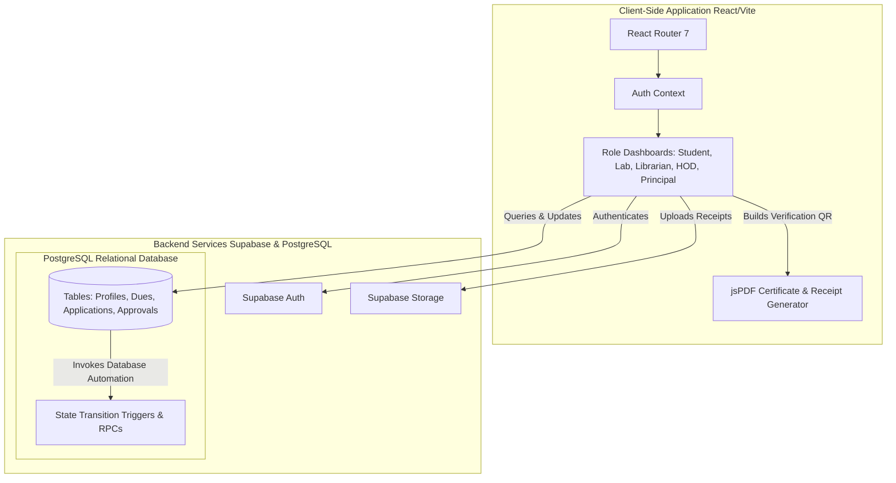

# Nexus - Graduation Clearance Portal

**Nexus** is a modern, web-based Graduation Clearance (No-Dues) system designed to digitize and automate the traditional manual clearance process in academic institutions. Instead of standing in queues for stamps, students can submit applications, upload required documentation, track clearances across departments in real-time, and download their certificates.

🌐 **Live URL:** [https://my-yess-ql-2.vercel.app/](https://my-yess-ql-2.vercel.app/)

---

## 📸 Interface Preview


---

## 📖 Project Case Study (STAR Method)

### 📌 Situation
At academic institutions, graduating students historically spent days waiting in long queues to secure physical "No-Dues" clearance stamps from multiple campus departments (Labs, Library, HOD, and Administration) before they could receive their degrees. This paper-heavy workflow was prone to errors, lacked tracking transparency, and placed a significant administrative burden on staff.

### 🎯 Task
Develop a secure, automated, and paperless digital pipeline that:
- Seamlessly moves clearance applications sequentially through departmental checkpoints.
- Enables students to upload verification receipts, track live approval progress, and pay pending dues.
- Empowers institutional administrators with dedicated panels to audit, comment on, and approve/reject applications.
- Instantly issues tamper-proof, verifiable clearance certificates to successful students.

### 🛠️ Action
- **Frontend & UX:** Engineered a fully responsive React 19 / TypeScript SPA from scratch, utilizing Framer Motion for micro-animations and a bespoke glassmorphic design system.
- **Backend & Security:** Built a relational database schema on Supabase (PostgreSQL), utilizing **Row-Level Security (RLS)** to partition student data and restrict department actions to authorized accounts.
- **State Automation:** Designed PostgreSQL database functions and triggers to automatically seed dues, manage state transitions, and enforce a strict approval order (Lab ➔ Library ➔ HOD ➔ Principal).
- **Security Utilities:** Integrated dynamic QR code generation (`qrcode.react`) and client-side PDF compilation (`html2canvas` + `jspdf`) to produce secure certificates with a digital validator page.

### 🏆 Result
- Completely eliminated physical paperwork, reducing student clearance processing time from days to minutes.
- Automated department handoffs, ensuring no approvals can be skipped or bypass institutional policies.
- Provided third-party recruiters with a 1-second verification page to authenticate graduates' certificates via a QR code.

---

## 🏗️ System Architecture



---

## ✨ Features

- **Multi-Stage Approval Pipeline:** A sequential approval process that flows dynamically from **Lab Verification** ➔ **Head of Department (HOD) Endorsement** ➔ **Principal Clearance**.
- **Real-Time Dues Heatmap:** Students get a visual status map showing which departments have approved their clearance and where dues are pending.
- **Unified Document Vault:** A secure storage system where students upload certificates, receipts, or fee-receipts for verification by corresponding authorities.
- **Granular Role-Based Access Control (RBAC):** Tailored dashboards and interfaces for:
  - **Students:** To request clearance, upload files, and check live status.
  - **Lab Assistants:** To verify departmental lab dues.
  - **HODs:** To sign off on department-level clearances.
  - **Principal / Admin:** For final institutional sign-off and system management.
- **Premium User Experience:** Implements an immersive glassmorphism theme, Space Grotesk/Inter typography, interactive particle backgrounds, and micro-interactions powered by Framer Motion.

---

## 🛠️ Tech Stack

- **Frontend:** React 19, TypeScript, Vite, React Router 7
- **Styling:** Vanilla CSS (Glassmorphism design system)
- **Database & Backend:** Supabase (PostgreSQL, Row-Level Security, Database Functions & Triggers)
- **Animations:** Framer Motion
- **Icons:** Lucide React

---

## 📂 Project Structure

```
├── docs/assets/          # Project images and screenshots
├── src/
│   ├── components/      # React functional components (Dashboard, Auth, LandingPage, etc.)
│   ├── contexts/        # Auth and global state contexts
│   ├── hooks/           # Custom React hooks (e.g. useSupabase)
│   ├── lib/             # Supabase client instantiation
│   ├── types/           # TypeScript interface definitions
│   ├── App.tsx          # Main application routing and core wrapper
│   ├── index.css        # Core design tokens and custom CSS theme
│   └── main.tsx         # App entry point
├── supabase_setup.sql   # Complete PostgreSQL schema, RLS policies, and triggers
└── package.json         # Node.js dependencies and scripts
```

---

## ⚙️ Local Development Setup

### Prerequisites
- Node.js (v18+)
- npm or yarn
- A Supabase Project

### 1. Clone & Install Dependencies
```bash
git clone https://github.com/AnupNerurkar/MyYessQL2.git
cd MyYessQL2
npm install
```

### 2. Environment Configuration
Create a `.env` file in the root directory (based on `.env.example`):
```env
VITE_SUPABASE_URL=your_supabase_project_url
VITE_SUPABASE_ANON_KEY=your_supabase_anon_key
```

### 3. Setup the Database
1. Go to your **Supabase Dashboard** ➔ **SQL Editor**.
2. Copy the entire contents of [supabase_setup.sql](file:///c:/Users/jayni/OneDrive/Documents/projects/myyessql2/supabase_setup.sql) and execute it.
3. This script will:
   - Create all necessary tables (`profiles`, `applications`, `approvals`, `documents`, `dues`).
   - Enable **Row-Level Security (RLS)** for data protection.
   - Install essential triggers and helper functions to manage the sequential approval pipeline and auto-create user profiles upon signup.

### 4. Run the Dev Server
```bash
npm run dev
```
Open your browser and navigate to `http://localhost:5173`.
